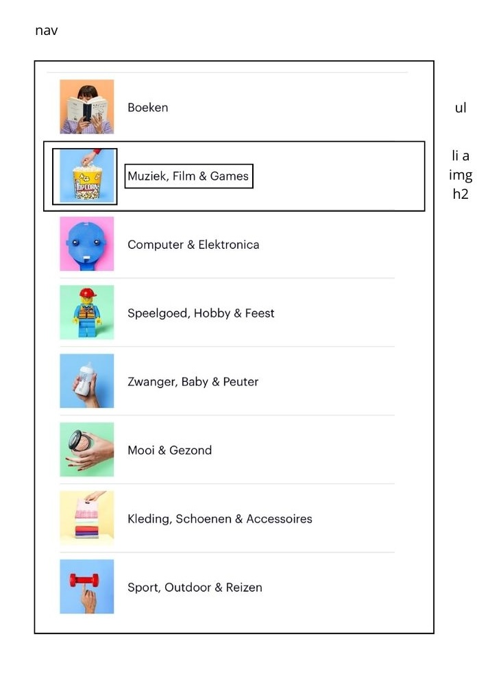
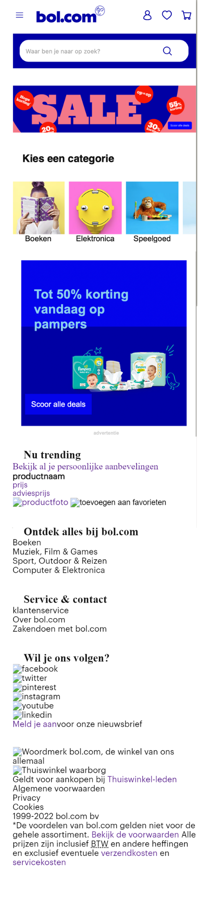
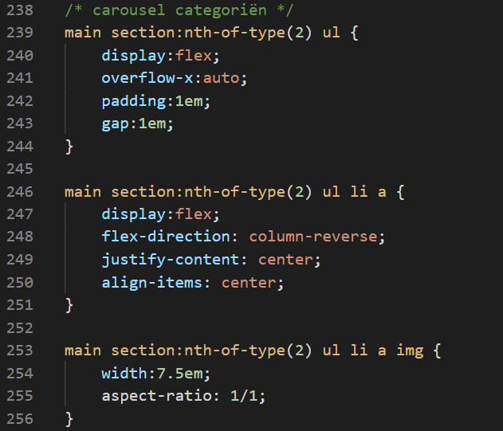
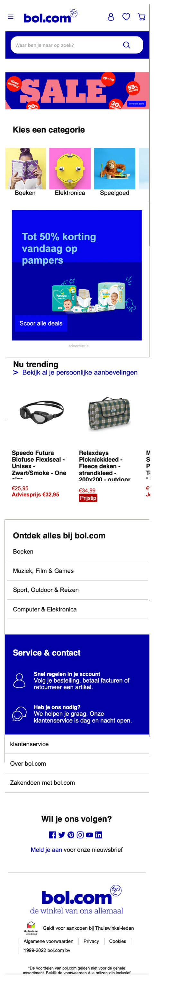
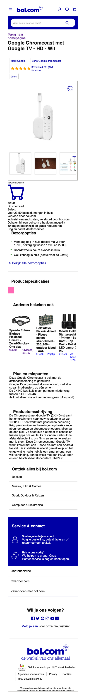

# Procesverslag
Markdown is een simpele manier om HTML te schrijven.  
Markdown cheat cheet: [Hulp bij het schrijven van Markdown](https://github.com/adam-p/markdown-here/wiki/Markdown-Cheatsheet).

Nb. De standaardstructuur en de spartaanse opmaak van de README.md zijn helemaal prima. Het gaat om de inhoud van je procesverslag. Besteedt de tijd voor pracht en praal aan je website.

Nb. Door *open* toe te voegen aan een *details* element kun je deze standaard open zetten. Fijn om dat steeds voor de relevante stuk(ken) te doen.

## Jij

  
uitwerken voor kick-off werkgroep

  ### Auteur:
  Carmen Brands

  #### Je startniveau:
  Blauw

  #### Je focus:
 Responsive 
 

## Je website

  
uitwerken voor kick-off werkgroep

  ### Je opdracht:
  https://www.bol.com/nl/nl/

  #### Screenshot(s) van de eerste pagina (small screen): 
  hier de naam van de pagina  
  

  #### Screenshot(s) van de tweede pagina (small screen):
  hier de naam van de pagina  
  
 

## Breakdownschets (week 2)

  
uitwerken na afloop 3e werkgroep

  ### de hele pagina: 
  
  

  ### dynamisch deel (bijv menu): 
  

  ### wellicht nog een dynamisch deel (bijv filter): 
  

## Voortgang 1 (week 3)

  
uitwerken voor 1e voortgang

  ### Stand van zaken
  hier dit ging goed & dit was lastig (neem ook screenshots op van delen van je website en code)
  Goed:
  1. ik had moeite met het opstarten 
  2. de breakdownschets maken ging wel goed
  3. moest alleen de betekenissen van alles weer opzoeken

  ### Verslag van meeting
  
  goed opweg let er alleen op met welke h ik gebruik

## Toegankelijkheidstest 1/2 (week 24)

  
uitwerken na test in 2e werkgroep

  ### Bevindingen
  Lijst met je bevindingen die in de test naar voren kwamen:

  #### Screenreader
  Hier korte omschrijving (met indien nodig afbeeldingen)
  Problemen:
  1. Screenreader skipt niet naar de volgende "H" als die niet in beeld is.
  2. Als de screenreader tussen linkjes skipt, leest hij de productinformatie voor zowel op de afbeelding als het tekstje daaronder (dubbele informatie).
  3. Als de gebruiker een item in zijn winkelwagen doet, krijgt hij geen audio-feedback dat dit gelukt is.

  Hier een omschrijving van hoe het opgelost kan worden (met indien nodig afbeeldingen)
  1. -
  2. Een aria-label toevoegen bij de linkjes (a-tags) van producten die ook een afbeelding bevatten en de alt-tekst van de afbeelding leeg laten.
  3. Automatische audio-feedback toevoegen.

  #### Muis en Toetsenbord 
  Hier korte omschrijving (met indien nodig afbeeldingen)
  Wat gaat goed:
  1. Focus state toont door omlijning waar de gebruiker zich op het scherm bevindt met voldoende contrast.
  2. Er zijn veel opties op de homepage, maar bol.com heeft genoeg ruimte per item gekozen zodat de gebruiker niet snel misklikt.
  
  Problemen:
  1. De navigatie opent niet als de gebruiker er met zijn tab-toets op staat en vervolgens op "enter" drukt.
  2. Geen feedback als de gebruiker hovered over: klikbare afbeeldingen, social media buttons en pijltje naar rechts om meer producten in de caroussel te bekijken.
  3. Geen feedback als de gebruiker op een knop klikt (active).
  

  Hier een omschrijving van hoe het opgelost kan worden (met indien nodig afbeeldingen)
  1. -
  2. Hover feedback toevoegen door bijvoorbeeld de kleur van het lettertype aan te passen, de gehele achtergrond van kleur te veranderen, vergroten van de tekst, tekst te omlijnen, etc.
  3. Active state toevoegen zodat gebruikers kunnen zien waar ze geklikt hebben.

  #### Motoriek (shocks, elastiekjes)
  Hier korte omschrijving (met indien nodig afbeeldingen)
  Problemen bij concentratie stoornis:
  1. Er zijn heel veel opties op de home-pagina die het lastig maken om alles in je op te nemen en een actie te kiezen. Bol doet al zijn best om deze keuzes te   beperken, maar het blijft lastig.

  Hier een omschrijving van hoe het opgelost kan worden (met indien nodig afbeeldingen)

  #### Visueel (brillen, contrast, kleurenblind, dark/light). 
  Hier korte omschrijving (met indien nodig afbeeldingen)
  Wat gaat goed:
  1. Central field loss: De gebruiker moet veel van links naar rechts kijken om de gehele content te bekijken. Doordat Bol zijn content in kleine vakjes heeft opgedeeld, blijft het redelijk scanbaar voor deze gebruikers.
  2. Kleurenblindheid heeft geen invloed op het onduidelijk maken van de content omdat het voldoende contrast heeft.
  
  Problemen:
  1. Periphal field loss: Kleine tekst op de site is lastig te lezen, bijvoorbeeld de items in het menu.
  2. Diabetic eye disease: De tekst is opzich leesbaar, maar het blijft lastig.
  3. Bij volledige kleurenblindheid is er geen feedback op de linkjes in de hoverstate in de footer.
  4. Gebruikers met blurred vision kunnen de dunne tekst in bijvoorbeeld de navigatie lastig lezen.
  5. Geen dark-mode beschikbaar
  
 
  Hier een omschrijving van hoe het opgelost kan worden (met indien nodig afbeeldingen)
  Oplossingen:
  1. Periphal field loss: Mogelijkheid geven om de tekstgrootte op de site aan te passen.
  2. Zelfde oplossing als periphal field loss. Zo kan elke gebruiker de site aanpassen op zijn specifieke needs.
  3. Hoverstate in de footer aanpassen door bij hover een lijntje onder de tekst te laten verschijnen.
  4. Mogelijkhed geven om het gewicht van de tekst aan te passen als gebruikers hier behoefte aan hebben.
  5. Dark-modus toevoegen waarbij bol.com meer gebruik maakt van gedempte kleuren en zwart/grijze achtergrond.

## Voortgang 2 (week 6)

  
uitwerken voor 2e voortgang

   
   

  ### Stand van zaken
  1. Carousel maken
  2. html screenreader friendly maken
  3. opstartproblemen met css en javascript

 ### Verslag van meeting
   1. Bij een input veld (bijvoorbeeld de bol.com zoekbalk) hoort altijd een label. Deze maak je dan visueel onzichtbaar zodat de screenreader hem nog wel ziet.
   2. Bij de zoekbalk zit ook een button zodat de gebruiker na het typen zijn zoekopdracht kan zoeken. Die button moet het type "submit" hebben, omdat je je zoekopdracht submit naar de server
   3. Als het bestand meerdere style sheets heeft, kan het ene style sheet variabele kleuren (e.d.) vanuit andere stylesheets halen.
   4. Scrollen op de main tijdens het openhebben van het menu kan voorkomen worden door overflowY:hidden op de main te zetten zodra het menu opent.

## Voortgang 3 (week 8)

  
uitwerken voor 3e voortgang

  ### Stand van zaken
  dit ging goed:
  1. Kopje "Service & Contact" stylen met grid

  dit ging minder:
  1. foutje gemaakt dus geen afbeeldingen opgeslagen dus moest deze opnieuw zetten

  ### Verslag van meeting
goed opweg afbeeldingen er nog inzetten en de code doornemen voor mondeling wat ging wat roestig omdat het door de vakantie wat roestig was geworden

## Toegankelijkheidstest 2/2 (week 9)

  
uitwerken na test in 9e werkgroep

  ### Bevindingen
  Lijst met je bevindingen die in de test naar voren kwamen (geef ook aan wat er verbeterd is):

  #### Screenreader
  Hier korte omschrijving (met indien nodig afbeeldingen)
  1. Als de gebruiker het menu opent, zegt de aria-label op de sluitbutton "open menu"
  2. Voor de rest is de code screenreader vriendelijk en kan de gebruiker langs alle kopjes en linkjes skippen.
  3. Goed dat het verborgen menu geskipt wordt en dat de tabtoets niet verdwijnt in het menu
  4. Netjes aria-labels toegepast op punten waar het nodig is

  

  Hier een omschrijving van hoe het opgelost kan worden
  1. Aria-label tekst aanpassen naar "sluit menu"

  #### Muis en Toetsenbord 
  Hier korte omschrijving (met indien nodig afbeeldingen)
  1. Met tabben kan de gebruiker niet zien waar hij is in de caroussel van categoriën
  2. Voor de rest kan de gebruiker met muis en toetsenbord overal op de site komen en krijgt hij feedback in de verschillende states.

  Hier een omschrijving van hoe het opgelost kan worden
  1. Focus state toevoegen aan carouselitems

  #### Motoriek (shocks, elastiekjes)
  Hier korte omschrijving (met indien nodig afbeeldingen)
  1. De app is goed te bedienen doordat de knoppen een redelijke grootte hebben. Met parkinson schiet de gebruiker af en toe nog wat uit en kan hij misklikken.
  2. Vergeleken met de originele site is deze gebruiksvriendelijker door de grotere knoppen em de grotere tekst

  Hier een omschrijving van hoe het opgelost kan worden
  1. Een modus maken waar de buttons groter zijn zodat de gebruiker minder snel misklikt

  #### Visueel (brillen, contrast, kleurenblind, dark/light). 
  Hier korte omschrijving (met indien nodig afbeeldingen)
  1. Bij blurred vision is sommige tekst lastig te lezen omdat het font dun is
  2. Met de andere visuele beperkingen zoals kleurenblindheid is de site nogsteeds goed leesbaar en is het contrast voldoende
  3. Als de gebruiker inzoomt op de browser (ctrl +) schaalt de content goed mee, dus gebruikers die hier behoefte aan hebben kunnen ook zelf de site vergroten door in te zoomen.

## Eindgesprek (week 10)

  
uitwerken voor eindgesprek

  ### Je uitkomst - karakteristiek screenshots:
  
  

   ### Dit ging goed/Heb ik geleerd: 
  Korte omschrijving met plaatjes
  1. Zorgen dat met tabben de gebruiker alleen door de navigatie kan als het opengeklapt is met "inset" attribute
  2. Zorgen dat de gebruiker niet over de main kan scrollen als het menu open is met overflow-Y:hidden op de main
  3. Structuur van een tabel en deze eenvoudig stylen
  4. Werken met grid
  5. Werken met positioning

  ### Dit was lastig/Is niet gelukt:
  1. hover/tab styling is lelijk en voelt niet aan als een echte website
  2. Darkmode toegevoegd en gecontroleerd of het contrast hoog genoeg is 
  3. Modus toevoegen met extra dikke/grotere letters voor gebruikers die daar behoefte aan hebben 

  

## Bronnenlijst

  
continu bijhouden terwijl je werkt

  Nb. Wees specifiek ('css-tricks' als bron is bijv. niet specifiek genoeg). 
  Nb. ChatGpT en andere AI horen er ook bij.
  Nb. Vermeld de bronnen ook in je code.

   1. voor de ster-shape van reviews https://www.coding-dude.com/wp/css/css-star/
   2. Bol.com  voor alle afbeeldingen en svg's
   3. het boek javascript & jquery van jon duckett

